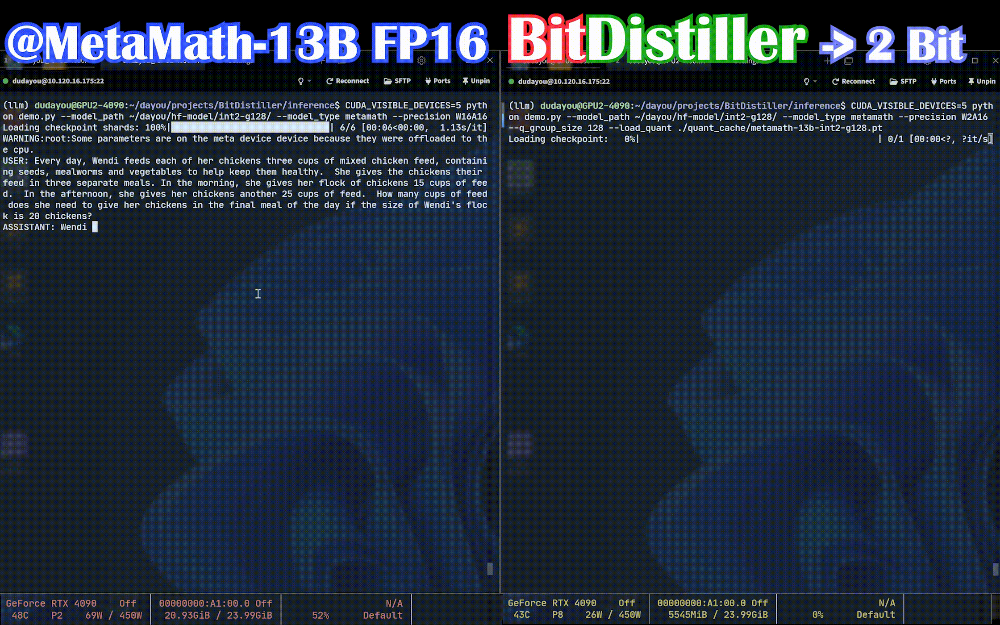

# TinyChat: Efficient and Lightweight Chatbot 


TinyChat leverages advanced CUDA and FP16 optimizations for enhanced chatbot efficiency. This project builds upon [TinyChat](https://github.com/mit-han-lab/llm-awq/tree/main/tinychat) by MIT-HAN Lab, incorporating efficient CUDA kernels and quantized model weights for improved performance.



# Getting Started
1. Install efficient CUDA kernel and optimized FP16 kernels (e.g. layernorm, positional encodings).
    ```bash
    pip install triton

    cd kernels
    python setup.py install
    ```

2. Generate quantized weight (4,2-bit)
    ```bash
    mkdir quant_cache
    # ckpt_path is the checkpoint from QAT
    python dump_quant.py --model_path <ckpt_path> --w_bit 2 --q_group_size 128 --dump_quant ./quant_cache/metamath-13b-int2-g128.pt
    ```

3. Run the TinyChat demo
    ```bash
    CUDA_VISIBLE_DEVICES=0 python demo.py --model_path <ckpt_path> --model_type metamath --precision W2A16 --q_group_size 128 --load_quant ./quant_cache/metamath-13b-int2-g128.pt 
    ```

# Acknowledgments
* [llm-awq](https://github.com/mit-han-lab/llm-awq/tree/main)
* [triton-awq](https://github.com/vedantroy/gpu_kernels/tree/main/awq)
