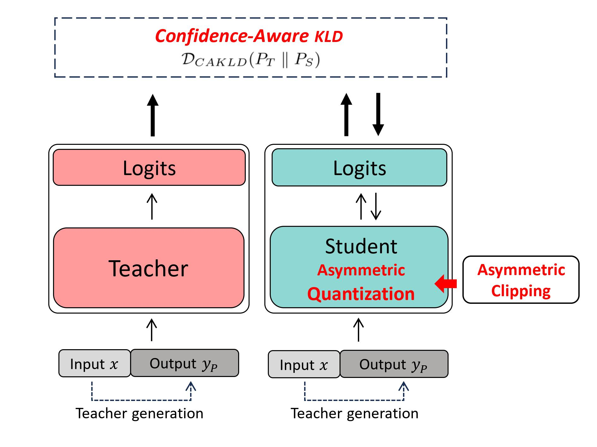
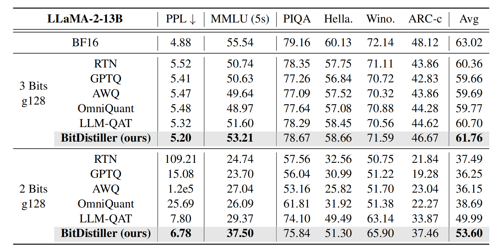
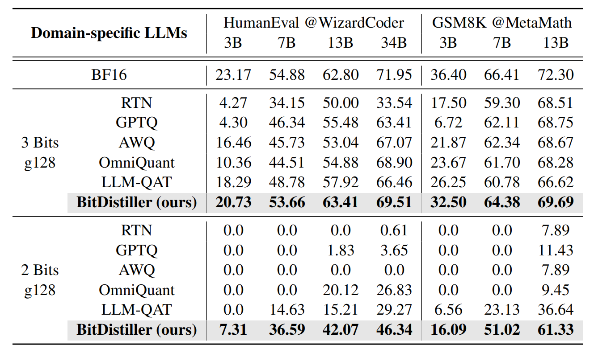

# BitDistiller: Unleashing the Potential of Sub-4-Bit LLMs via Self-Distillation

**Accurate** sub-4-bit weight quantization (3 / 2 bits) for LLMs with **QAT-based Self-Distillation**.



## Comparing general language tasks with other methods


## Comparing reasoning benchmarks with other methods



## Contents
1. [Setup](#1-setup)
2. [Running](#2-running)
3. [Evaluation](#3-evaluation)

## 1. Setup
* python 3.9, pytorch >= 1.13
* pip install -r requirement.txt

## 2. Running
<details>
  <summary>LLaMA-2</summary>
  
1. Get the Clipping result
    ```bash
    cd BitDistiller/quantization

    CUDA_VISIBLE_DEVICES=0 python autoclip.py --model_path <model_path> --calib_dataset pile --w_bit 2 --q_group_size 128 --run_clip --dump_clip ./clip_cache/hf-llama2-7b/int2-g128.pt
    ```
2. Get the Teacher Generation Data
    ```bash
    cd BitDistiller/data/generation

    bash generate.sh <model_path> wikitext ../datasets/hf-llama-2-7b/ 16 3000

    bash generate.sh <model_path> alpaca ../datasets/hf-llama-2-7b/ 16 5000

    python mix_data.py
    ```
3. Run KD-base QAT
    ```bash
    # Specify the pre-trained model path
    # Specify the num_gpus and batch_size according to your GPU devices
    # Specify the clipping cache path to the --clip

    cd train
    
    bash train.sh ../data/datasets/hf-llama-2-7b/mix_wiki_alpaca_8000.json ./ckpts/hf-llama-2-7b/int2-g128/ ./logs/hf-llama-2-7b/int2-g128/ 4
    ```
</details>

<details>
  <summary>WizardCoder</summary>
  
1. Get the Clipping result
    ```bash
    cd BitDistiller/quantization

    CUDA_VISIBLE_DEVICES=0 python autoclip.py --model_path <model_path> --calib_dataset code --w_bit 2 --q_group_size 128 --run_clip --dump_clip ./clip_cache/WizardCoder-7B/int2-g128.pt
    ```
2. Get the Teacher Generation Data
    ```bash
    cd BitDistiller/data/generation

    bash generate.sh /root/WizardCoder-Python-7B/ code ../datasets/WizardCoder-7b/ 16 3000
    ```
3. Run KD-base QAT
    ```bash
    # Specify the pre-trained model path
    # Specify the num_gpus and batch_size according to your GPU devices
    # Specify the clipping cache path to the --clip

    cd train
    
    bash train.sh ../data/datasets/WizardCoder-7b/code_T0.7_N1024_S42_3000.json ./ckpts/WizardCoder-7b/int2-g128/ ./logs/WizardCoder-7b/int2-g128/ 2
    ```
</details>

<details>
  <summary>MetaMath</summary>

1. Get the Clipping result
    ```bash
    cd BitDistiller/quantization

    CUDA_VISIBLE_DEVICES=0 python autoclip.py --model_path <model_path> --calib_dataset gsm8k --w_bit 2 --q_group_size 128 --run_clip --dump_clip ./clip_cache/MetaMath-7B/int2-g128.pt
    ```
2. Get the Teacher Generation Data
    ```bash
    cd BitDistiller/data/generation

    bash generate.sh /root/MetaMath-7B-V1.0/ math ../datasets/MetaMath-7B/ 16 3000
    ```
3. Run KD-base QAT
    ```bash
    # Specify the pre-trained model path
    # Specify the num_gpus and batch_size according to your GPU devices
    # Specify the clipping cache path to the --clip

    cd train
    
    bash train.sh ../data/datasets/MetaMath-7B/math_T0.7_N1024_S42_3000.json ./ckpts/MetaMath-7b/int2-g128/ ./logs/MetaMath-7b/int2-g128/ 2
    ```
</details>

## 3. Evaluation
<details>
  <summary>LLaMA-2</summary>

* Test PPL on WikiText-2
  ```bash
  cd test/general

  python wiki_ppl.py --model ../../train/ckpts/hf-llama-2-7b/int2-g128/checkpoint-200/ --quant_type int --bits 2 --group_size 128
  ```
* Test MMLU
  ```bash
  CUDA_VISIBLE_DEVICES=0 python llm_eval.py --model ../../train/ckpts/hf-llama-2-7b/int2-g128/checkpoint-200/ --eval_tasks hendrycksTest-* --test_set --bits 2 --group_size 128 --quant_type int --num_fewshot 5
  ```
* Test Common-sense QA Tasks
  ```bash
  CUDA_VISIBLE_DEVICES=0 python llm_eval.py --model ../../train/ckpts/hf-llama-2-7b/int2-g128/checkpoint-200/ --eval_tasks arc_challenge,winogrande,hellaswag,piqa --test_set --bits 2 --group_size 128 --quant_type int --num_fewshot 0 
  ```

</details>

<details>
  <summary>WizardCoder</summary>

* Install the environment according to the instructions of [HumanEval](https://github.com/openai/human-eval), 

* Example script:
    ```bash
    cd test/humaneval
    bash gen_preds.sh [checkpoint_path] ./preds/7b/int2-g128/
    ```
</details>

<details>
  <summary>MetaMath</summary>
  
* Example script:

    ```bash
    cd test/gsm8k
    bash test.sh ../../train/ckpts/MetaMath-7b/int2-g128/ ./preds/7b/int2-g128/
    ```
</details>
